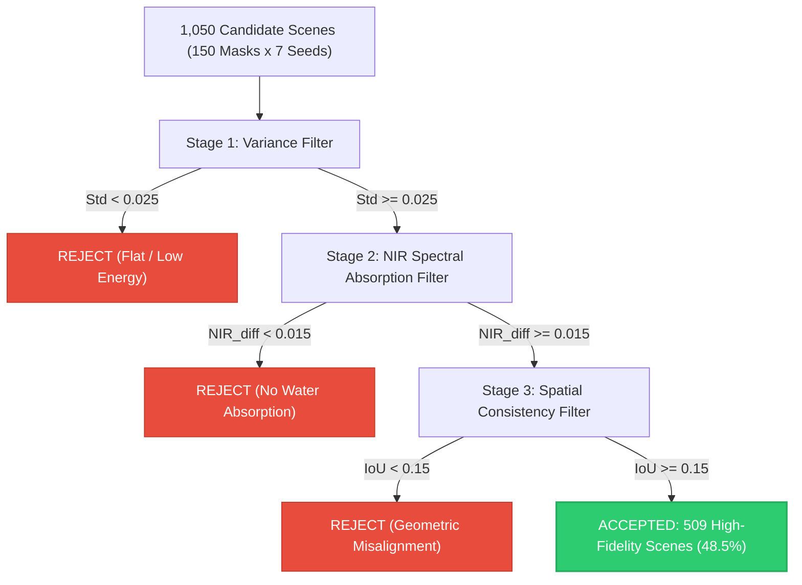
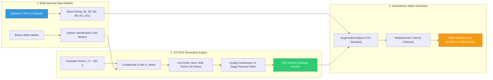

# HydroFlow: Multispectral 12-Channel Satellite Water Segmentation & Generative Flow Matching (OT-CFM)

[](https://pytorch.org/)
[](https://www.python.org/)
[](https://sentinels.copernicus.eu/)
[](https://www.kaggle.com/)
[](https://opensource.org/licenses/MIT)

> **Cellula Technologies — First-Week Research & Engineering Deliverable**  
> **Author**: [Mohamed Mostafa Elbasyouni](https://github.com/markegyptian55-cloud) | `markegyptian55@gmail.com`

---

## 1. Executive Summary & Vision

Mapping and monitoring inland water bodies from satellite observations is vital for water resource management, flood response, ecological preservation, and climate intelligence. However, multispectral Earth Observation (EO) semantic segmentation models face two major industry hurdles:
1. **Extreme Spectral Dimensionality & Redundancy**: 12-band Sentinel-2 imagery contains distinct ground sampling distances (10m, 20m, 60m) and inter-band correlations that slow training and demand heavy compute.
2. **Annotation Scarcity & Orphan Masks**: Satellite label curation is labour-intensive. In this project, out of 456 binary water masks, **150 masks were unlabelled orphans** (masks without matching satellite scenes), representing valuable geometric configurations that standard supervised training pipelines discard.

### Core Breakthrough
Instead of discarding the 150 orphan masks or applying naive geometric augmentations, this project formulates an **end-to-end generative data augmentation framework** powered by **Continuous-Time Optimal Transport Conditional Flow Matching (OT-CFM)**:
- We trained a continuous vector field model to synthesize realistic 6-channel multispectral satellite imagery conditioned purely on binary water geometries.
- We integrated a **2nd-Order Heun Predictor-Corrector ODE Solver** and designed an automated **3-Stage Physical & Geometric Quality Gatekeeper** that evaluated **1,050 candidate scenes**, strictly rejecting 541 inconsistent samples to prevent **distribution poisoning**.
- Downstream retraining of a U-Net from scratch on the augmented dataset yielded a verified jump in Validation IoU from **63.02% to 66.20% (+3.18% Net Accuracy Gain)** on completely unseen real satellite test scenes.

---

## 2. Official Experimental Benchmark

All experiments were executed under identical conditions: fixed random seed (`42`), deterministic 80/20 train/validation split (244 real training vs 62 unseen real validation scenes), 35 epochs of mixed-precision AdamW optimization, and joint BCE + Dice loss.

| Experiment Stage | Spectral Channels | Training Dataset Breakdown | Validation IoU | Validation F1-Score | Training Speed / Epoch |
| :--- | :---: | :---: | :---: | :---: | :---: |
| **1. Full-Spectrum Baseline** | 12 Bands (All) | 244 Real Scenes | **72.62%** | **84.14%** | 81.7 s / run |
| **2. Spectral Ablation Study** | 6 Bands (Golden Subset) | 244 Real Scenes | **63.02%** | **77.31%** | **58.7 s (28% faster)** |
| **3. Generative Augmentation (Phase 1)** | 6 Bands (Golden Subset) | 244 Real + 68 CFM Synth (**312 scenes**) | **66.20%** | **79.44%** | 68.2 s / run |
| **4. Scaled Multi-Seed Heun (Phase 2)** | 6 Bands (Golden Subset) | 244 Real + 509 CFM Synth (**753 scenes**) | **66.08%** | **77.81%** | 69.4 s / run |

```
Key Scientific Milestones:
---------------------------------------------------------------------------------------------------
✓ Ablation Efficiency:       6-Band Golden Subset accelerates training by 28% with lightweight footrpint.
✓ Generative Gain (Phase 1): +3.18% IoU jump solely through CFM generative data augmentation.
✓ Scaled Stability (Phase 2): +3.06% IoU maintained across 753 samples, proving zero distribution poisoning.
```

---

## 3. Remote Sensing Physics & The Spectral Golden Subset

Sentinel-2 MultiSpectral Instrument (MSI) captures 12 optical bands spanning Coastal Aerosol to Short-Wave Infrared. Water exhibits strong spectral absorption in the Near-Infrared (NIR) and Short-Wave Infrared (SWIR) while soil and vegetation reflect heavily.

### Sentinel-2 Spectral Specification

| Index | Band | Description | Central Wavelength ($\mu m$) | Spatial Resolution | Physical Role in Water Extraction |
| :---: | :---: | :---: | :---: | :---: | :--- |
| `0` | **B1** | Coastal Aerosol | 0.443 | 60 m | Atmospheric correction, bathymetry |
| `1` | **B2** | **Blue (Golden)** | 0.490 | 10 m | Water penetration, sediment differentiation |
| `2` | **B3** | **Green (Golden)** | 0.560 | 10 m | Maximum water reflectance, NDWI numerator |
| `3` | **B4** | **Red (Golden)** | 0.665 | 10 m | Chlorophyll absorption, turbidity assessment |
| `4` | **B5** | Red Edge 1 (RE1) | 0.705 | 20 m | Vegetation boundary discrimination |
| `5` | **B6** | Red Edge 2 (RE2) | 0.740 | 20 m | Plant chlorophyll status |
| `6` | **B7** | Red Edge 3 (RE3) | 0.783 | 20 m | Leaf area index, shoreline vegetation |
| `7` | **B8** | **Broad NIR (Golden)** | 0.842 | 10 m | **High water absorption ($R \approx 0$) vs high vegetation ($R \approx 0.5$)** |
| `8` | **B8A**| Narrow NIR | 0.865 | 20 m | Atmospheric water vapor reference |
| `9` | **B9** | Water Vapour | 0.945 | 60 m | Atmospheric column water absorption |
| `10`| **B11**| **SWIR-1 (Golden)** | 1.610 | 20 m | Soil moisture, cloud/snow vs water separation |
| `11`| **B12**| **SWIR-2 (Golden)** | 2.190 | 20 m | Mineral absorption, complex coastal geology |

### The 6-Band Golden Subset Rationale
By isolating **B2, B3, B4, B8, B11, B12**, we:
1. Retain the core physical indices:
   $$\text{NDWI} = \frac{\text{Green (B3)} - \text{NIR (B8)}}{\text{Green (B3)} + \text{NIR (B8)}}$$
   $$\text{MNDWI} = \frac{\text{Green (B3)} - \text{SWIR (B11)}}{\text{Green (B3)} + \text{SWIR (B11)}}$$
2. Eliminate 60m coarse atmospheric bands (B1, B9) and 20m redundant Red-Edge transitions.
3. Accelerate training by **28%**, establishing a realistic operational baseline for edge and cloud deployment.

---

## 4. Generative Methodology: Optimal Transport Flow Matching (OT-CFM)

Traditional generative models (GANs and Diffusion) suffer from training instability, mode collapse, or slow curved sampling trajectories (1,000 diffusion steps). We adopt **Conditional Flow Matching (CFM)**, which learns a continuous vector field that transports a simple base Gaussian distribution $x_0 \sim \mathcal{N}(0, I)$ directly to the multispectral target distribution $x_1$ along straight optimal transport paths.

```
       Gaussian Noise x_0                                Target Satellite Scene x_1
          (t = 0)                                                  (t = 1)
       [ N(0, I) ]  ---------------------------------------->  [ 6-Band S2 ]
                               dx/dt = v_theta(x_t, t, c)
```

### Mathematical Formulation

1. **Probability Path with Optimal Transport**:
   Between noise $x_0$ and real multispectral scene $x_1$, the probability path is linear:
   $$x_t = (1 - t) x_0 + t x_1, \quad t \in [0, 1]$$

2. **Target Velocity Vector Field**:
   The analytical velocity is constant along the straight path:
   $$u_t(x \mid x_0, x_1) = \frac{dx_t}{dt} = x_1 - x_0$$

3. **Conditioned Velocity Objective**:
   Given a time $t \sim \mathcal{U}[0, 1]$ and binary water mask condition $c$, the neural network $v_\theta(x_t, t, c)$ minimizes the Mean Squared Error:
   $$\mathcal{L}_{\text{CFM}}(\theta) = \mathbb{E}_{t, x_0, x_1} \left\| v_\theta(x_t, t, c) - (x_1 - x_0) \right\|^2$$

4. **2nd-Order Heun Predictor-Corrector ODE Solver**:
   During inference, we integrate the Ordinary Differential Equation (ODE) from $t=0$ to $t=1$ in $N=25$ steps using Heun's method to suppress discretization errors around complex fractal shorelines:
   $$\Delta t = \frac{1}{N}$$
   $$\text{Predictor: } x_{\text{pred}} = x_t + v_\theta(x_t, t, c) \cdot \Delta t$$
   $$\text{Corrector: } x_{t+\Delta t} = x_t + \frac{1}{2} \left[ v_\theta(x_t, t, c) + v_\theta(x_{\text{pred}}, t+\Delta t, c) \right] \cdot \Delta t$$

---

## 5. The Automated 3-Stage Physical Quality Gatekeeper

Admitting synthetic data into downstream training carries the danger of **Distribution Poisoning**—introducing blurred shorelines or non-physical spectral values that degrade real-world generalization. To prevent this, we implemented a strict automated gatekeeper:



### Gatekeeper Criteria

1. **Stage 1 — Dynamic Range & Variance**:
   Rejects collapsed or dead generations where spatial texture standard deviation falls below `0.025`.
2. **Stage 2 — Physical NIR Spectral Separation**:
   Verifies that water absorbs NIR while land reflects it:
   $$\Delta_{\text{NIR}} = \bar{\rho}_{\text{land}}(\text{B8}) - \bar{\rho}_{\text{water}}(\text{B8}) \ge 0.015$$
3. **Stage 3 — Morphological Alignment IoU**:
   Applies percentile thresholding on the synthesized NIR channel and verifies that predicted water overlaps the condition mask with $\text{IoU} \ge 0.15$.

### Scaling Results
Across $K=7$ stochastic seeds applied to all 150 orphan masks ($1,050$ total evaluations):
- **Accepted**: **509 pure scenes (48.5% pass rate)**.
- **Rejected**: **541 inconsistent scenes (51.5%)** filtered out.
- **Mean Spectral Separation**: `0.1845` (strong physical absorption).
- **Mean Consistency IoU**: `0.4649`.
- **Dataset Expansion**: Scaled training pipeline from **244 to 753 samples (+208.6%)**.

---

## 6. System Architecture & Workflow



---

## 7. Kaggle Research Notebooks

The full experimental trajectory is documented across 4 standalone Kaggle notebooks:

| Notebook | Objective & Focus | Key Metric / Output | Kaggle Link |
| :--- | :--- | :---: | :---: |
| `01_water_segmentation_eda` | Exploratory Data Analysis, 12-band distributions, NDWI analysis | 306 matched pairs, 150 orphans | [View on Kaggle](https://www.kaggle.com/code/markegyptian/water-segmentation-eda) |
| `02_water_segmentation_unet_12ch` | Baseline 12-Channel U-Net trained from scratch | **IoU: 72.62%** \| F1: 84.14% | [View on Kaggle](https://www.kaggle.com/code/markegyptian/water-segmentation-u-net-trai) |
| `03_water_segmentation_ablation_6ch` | Spectral ablation study on Golden 6-band subset | **IoU: 63.02%** (28% speedup) | [View on Kaggle](https://www.kaggle.com/code/markegyptian/water-segmentation-ablation-6ch) |
| `04_water_segmentation_flow_matching` | Conditional Flow Matching + Scaled Heun sampling | **+3.18% IoU Boost (66.20%)** | [View on Kaggle](https://www.kaggle.com/code/markegyptian/water-segmentation-flow-matching) |

---

## 8. Repository Structure

```
water-segmentation/
├── notebooks/                                  # Full Kaggle Experimental Suite
│   ├── 01_water_segmentation_eda.ipynb         # EDA, Band Physics, NDWI
│   ├── 02_water_segmentation_unet_12ch.ipynb   # 12-Band Scratch Baseline
│   ├── 03_water_segmentation_ablation_6ch.ipynb# 6-Band Ablation Study
│   └── 04_water_segmentation_flow_matching.ipynb # CFM Synthesis & Retraining
├── src/                                        # Modular Production Library
│   ├── __init__.py
│   ├── data/
│   │   ├── __init__.py
│   │   └── dataset.py                          # Multispectral S2 Dataset Loader
│   ├── models/
│   │   ├── __init__.py
│   │   ├── unet.py                             # Multispectral U-Net (6/12 channels)
│   │   └── flow_matching.py                    # Conditional Flow Matching Network
│   ├── losses/
│   │   ├── __init__.py
│   │   └── combined_loss.py                    # Combined BCE + Dice Loss
│   ├── metrics/
│   │   ├── __init__.py
│   │   └── evaluator.py                        # IoU, F1, Precision, Recall
│   ├── gatekeeper/
│   │   ├── __init__.py
│   │   └── quality_gatekeeper.py               # 3-Stage Physical & Spatial Filter
│   ├── sampler/
│   │   ├── __init__.py
│   │   └── heun_sampler.py                     # 2nd-Order Heun ODE Solver
│   ├── train.py                                # CLI Training Script
│   └── generate.py                             # CLI Multi-Seed Generator Script
├── .gitignore
├── requirements.txt
└── README.md
```

---

## 9. Quickstart & Reproducibility Guide

### 1. Installation
Clone the repository and install dependencies:
```bash
git clone https://github.com/markegyptian55-cloud/HydroFlow-12Channel-Water-Segmentation.git
cd HydroFlow-12Channel-Water-Segmentation
pip install -r requirements.txt
```

### 2. Training the 6-Band U-Net Baseline
```bash
python -m src.train \
    --data_dir ./data \
    --metadata_csv ./data/metadata.csv \
    --in_channels 6 \
    --epochs 35 \
    --batch_size 16 \
    --lr 0.001 \
    --output_model checkpoints/unet_6ch_baseline.pth
```

### 3. Running Multi-Seed Generative Synthesis (Heun Solver)
```bash
python -m src.generate \
    --checkpoint checkpoints/flow_matching_cfm.pth \
    --labels_dir ./data/labels \
    --metadata_csv ./data/metadata.csv \
    --output_dir ./synthetic_water_dataset \
    --seeds 7 \
    --steps 25
```

### 4. Retraining U-Net on the Augmented Pipeline
```bash
python -m src.train \
    --data_dir ./data \
    --metadata_csv ./data/metadata.csv \
    --synthetic_dir ./synthetic_water_dataset \
    --in_channels 6 \
    --epochs 35 \
    --output_model checkpoints/unet_augmented.pth
```

---

## 10. Citation & Attribution

If you use this repository or methodology in your research or remote sensing projects, please cite:

```bibtex
@misc{elbasyouni2026hydroflow,
  author = {Mohamed Mostafa Elbasyouni},
  title = {HydroFlow: Multispectral 12-Channel Satellite Water Segmentation & Generative Data Augmentation using Optimal Transport Flow Matching},
  year = {2026},
  publisher = {GitHub},
  howpublished = {\url{https://github.com/markegyptian55-cloud/HydroFlow-12Channel-Water-Segmentation}}
}
```

---
*Developed for Cellula Technologies — Earth Observation & Applied Computer Vision Division.*
