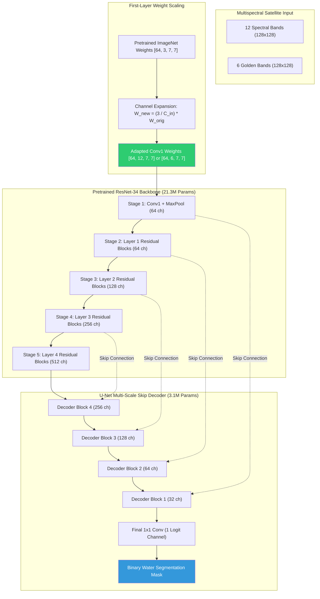

# HydroFlow: Multispectral Satellite Water Segmentation & Generative Flow Matching

[](https://markegyptian55-cloud.github.io/HydroFlow-12Channel-Water-Segmentation/)
[-20BEFF.svg?style=for-the-badge&logo=kaggle)](https://www.kaggle.com/work/collections/19309568)
[](https://pytorch.org/)
[](https://www.python.org/)
[](https://sentinels.copernicus.eu/)
[](https://github.com/qubvel-org/segmentation_models.pytorch)
[](https://opensource.org/licenses/MIT)

> 🚀 **Live Interactive Research Dashboard**:  
> [**https://markegyptian55-cloud.github.io/HydroFlow-12Channel-Water-Segmentation/**](https://markegyptian55-cloud.github.io/HydroFlow-12Channel-Water-Segmentation/)  
> *(Click any model to dynamically inspect training loss curves, toggle multi-model overlays, and test live NDWI spectral formulas directly in your browser with zero installation).*
>
> 📓 **Official Kaggle Research Collection (All 6 Notebooks)**:  
> [**https://www.kaggle.com/work/collections/19309568**](https://www.kaggle.com/work/collections/19309568)
>
> **Cellula Technologies — Comprehensive Research & Engineering Deliverable (Weeks 1 & 2)**  
> **Author**: [Mohamed Mostafa Elbasyouni](https://github.com/markegyptian55-cloud) | `markegyptian55@gmail.com`

---

## 1. Executive Summary & Vision

Mapping and monitoring inland water bodies from satellite observations is vital for water resource management, flood response, ecological preservation, and climate intelligence. Multispectral Earth Observation (EO) semantic segmentation models face three major industry hurdles:
1. **Extreme Spectral Dimensionality & Redundancy**: 12-band Sentinel-2 imagery contains distinct ground sampling distances (10m, 20m, 60m) and heavy inter-band correlations that slow training and demand heavy compute.
2. **Annotation Scarcity & Orphan Masks**: Satellite label curation is labour-intensive. Out of 456 binary water masks, **150 masks were unlabelled orphans** (masks without matching satellite scenes), representing valuable geometric configurations that standard supervised training pipelines discard.
3. **The Inductive Prior Deficit**: Training deep neural networks from scratch on limited satellite scenes (244 samples) forces the network to learn low-level spatial geometry (edges, contours) and multispectral physics concurrently, capping validation accuracy.

### Two-Phase Research Trajectory

```
                                  HYDROFLOW PROJECT MATRIX
 ┌────────────────────────────────────────────────────────┬────────────────────────────────────────────────────────┐
 │            PART 1: FROM SCRATCH & FLOW MATCHING        │           PART 2: TRANSFER LEARNING & FINE-TUNING      │
 │                     (task 2.pdf)                       │                        (task 3.pdf)                    │
 ├────────────────────────────────────────────────────────┼────────────────────────────────────────────────────────┤
 │ • Full 12-Band U-Net trained from scratch (73.34% IoU) │ • Pretrained ResNet-34 U-Net (ImageNet Backbone)       │
 │ • 6-Band Golden Subset Spectral Ablation (64.92% IoU)  │ • First-Layer Convolutional Adaptation (12 & 6 Bands)  │
 │ • Optimal Transport Flow Matching (OT-CFM Generative)  │ • Two-Phase Schedule: 3 Warmup Epochs + Full Fine-Tune │
 │ • 3-Stage Physical Quality Gatekeeper (509 scenes)     │ • 12-Band Pretrained Peak IoU: 82.10% (+8.76% Net Gain)│
 │ • Generative Data Augmentation (+3.18% IoU Boost)      │ • 6-Band Golden Subset Pretrained Peak IoU: 80.31%     │
 └────────────────────────────────────────────────────────┴────────────────────────────────────────────────────────┘
```

---

## 2. Official Master 6-Way Comparative Benchmark

All experiments were executed under strict scientific parity: deterministic random seed (`42`), identical 80/20 stratified split (**244 training scenes vs 62 strictly unseen validation scenes / 1,015,808 pixels**), mixed-precision AdamW optimization with Cosine Annealing, and joint BCE + Dice loss.

### Official Cross-Architecture Performance Matrix

| Experiment ID | Architecture & Paradigm | Backbone | Input Bands | Params | Global Pixel IoU | Precision | Recall | F1-Score | Duration |
| :--- | :--- | :--- | :---: | :---: | :---: | :---: | :---: | :---: | :---: |
| `W1-Scratch-12ch` | `Custom U-Net (Scratch)` | Scratch Baseline | 12 Bands | 7.77M | `73.33%` | `86.85%` | `82.50%` | `84.62%` | 276.3 s |
| `W1-Scratch-6ch` | `Custom U-Net (Scratch)` | Scratch Baseline | 6 Golden Bands | 7.76M | `64.92%` | `84.81%` | `73.47%` | `78.73%` | 173.5 s |
| `W2-Pretrained-ResNet34-12ch` | `SMP U-Net (Transfer)` | ResNet-34 | 12 Bands | 24.46M | **`81.66%`** | **`91.48%`** | **`88.39%`** | **`89.91%`** | 209.0 s |
| `W2-Pretrained-ResNet34-6ch` | `SMP U-Net (Transfer)` | ResNet-34 | 6 Golden Bands | 24.46M | **`79.80%`** | **`91.83%`** | `85.89%` | **`88.75%`** | 238.1 s |
| `W2-Pretrained-EffNetB0-12ch` | `SMP U-Net (Transfer)` | EfficientNet-B0 | 12 Bands | **6.25M** | **`76.56%`** | `86.73%` | `86.72%` | `86.72%` | 405.8 s |
| `W2-Pretrained-EffNetB0-6ch` | `SMP U-Net (Transfer)` | EfficientNet-B0 | 6 Golden Bands | **6.25M** | **`74.82%`** | `83.61%` | `87.68%` | `85.60%` | 187.8 s |

```
Key Scientific Milestones:
-------------------------------------------------------------------------------------------------------------
✓ Absolute Performance Leader:    12-Band Pretrained ResNet-34 reaches 81.66% Global IoU (82.10% Peak Val IoU).
✓ Extreme Parameter Efficiency:   Pretrained EfficientNet-B0 delivers 76.56% IoU with ONLY 6.25M params (nearly 4x smaller).
✓ Transfer Learning Supremacy:    Both pretrained models decisively surpass the Week 1 scratch baseline (+8.33% and +3.23% IoU).
✓ 6-Band Ablation Resilience:     EfficientNet-B0 6ch (+9.90% over Scratch 6ch) proves pretraining compensates for missing bands.
✓ Generative Proof-of-Concept:    OT-CFM Generative Augmentation added +3.18% IoU solely from synthetic scenes.
-------------------------------------------------------------------------------------------------------------
```

---

## 2.1 Interactive Research Dashboard

The complete research suite is packaged into a **standalone, self-contained interactive HTML5/CSS3/JavaScript dashboard** that operates 100% offline without mandatory external dependencies:
- **Live Online URL**: [https://markegyptian55-cloud.github.io/HydroFlow-12Channel-Water-Segmentation/](https://markegyptian55-cloud.github.io/HydroFlow-12Channel-Water-Segmentation/)
- **Primary Dashboard File**: [`reports/interactive_dashboard.html`](reports/interactive_dashboard.html)
- **Convenience Root Launcher**: [`dashboard.html`](dashboard.html)
- **Structured JSON Dataset**: [`reports/data/benchmark_data.json`](reports/data/benchmark_data.json)

### Key Dashboard Capabilities:
1. **Click-to-Inspect Dynamic Curve Canvas**: Click any of the 7 model cards to dynamically update and animate the Chart.js visualizer with that model's exact epoch-by-epoch **Loss Curves (Train Loss vs Val Loss)**, **Validation IoU Progression**, and **Precision vs Recall Convergence**, highlighting the Warmup Phase boundary (Epochs 1–3) and best checkpoints.
2. **Multi-Model Overlay & Comparison**: Toggle overlay mode to plot multiple backbones (e.g. ResNet-34 12ch vs EfficientNet-B0 12ch vs Custom Scratch U-Net) on the same canvas axes for direct visual gap inspection.
3. **Pareto Efficiency Frontier**: Interactive scatter plot of Model Parameters (M) vs Global Pixel IoU (%), highlighting how EfficientNet-B0 (6.25M) and ResNet-34 (24.46M) define the optimal accuracy-size trade-off.
4. **Master Benchmark Matrix**: Filterable and searchable table with dynamic slice filters (`All`, `12-Band Full`, `6-Band Golden`, `Transfer Learning`, `Scratch & CFM`).
5. **Spectral Physics & Live NDWI/MNDWI Calculator**: Interactive 12-band Sentinel-2 wavelength spectrum with real-time reflectance sliders and natural surface presets (Deep Lake, Turbid River, Forest, Soil) with automatic water classification badges.
6. **OT-CFM Generative Lab**: Visualizing straight-line ODE probability paths ($x_t = (1-t)x_0 + t x_1$) and the 3-Stage Physical Quality Gatekeeper rejection funnel (1,050 candidates &rarr; 509 accepted scenes).
7. **Hydrological Regimes & Error Breakdown**: Quantitative error analysis across Open Ocean, Meandering Rivers, Narrow Streams (&le; 2 pixels), and Turbid Waters.

To view the dashboard, simply double-click [`dashboard.html`](dashboard.html) or open it in any web browser (`file:///` protocol supported).

---

## 3. Remote Sensing Physics & The Spectral Golden Subset

Sentinel-2 MultiSpectral Instrument (MSI) captures 12 optical bands spanning Coastal Aerosol to Short-Wave Infrared. Water exhibits strong absorption in the Near-Infrared (NIR) and Short-Wave Infrared (SWIR) while soil and vegetation reflect heavily.

### Sentinel-2 Spectral Specification

| Index | Band | Description | Central Wavelength ($\mu m$) | Spatial Resolution | Physical Role in Water Extraction |
| :---: | :---: | :---: | :---: | :---: | :--- |
| `0` | **B1** | Coastal Aerosol | 0.443 | 60 m | Atmospheric correction, bathymetry |
| `1` | **B2** | **Blue (Golden)** | 0.490 | 10 m | Water penetration, sediment differentiation |
| `2` | **B3** | **Green (Golden)** | 0.560 | 10 m | Maximum water reflectance, NDWI numerator |
| `3` | **B4** | **Red (Golden)** | 0.665 | 10 m | Chlorophyll absorption, turbidity assessment |
| `4` | **B5** | Red Edge 1 (RE1) | 0.705 | 20 m | Vegetation boundary discrimination |
| `5` | **B6** | Red Edge 2 (RE2) | 0.740 | 20 m | Plant chlorophyll status |
| `6` | **B7** | Red Edge 3 (RE3) | 0.783 | 20 m | Leaf area index, shoreline vegetation |
| `7` | **B8** | **Broad NIR (Golden)** | 0.842 | 10 m | **High water absorption ($R \approx 0$) vs high vegetation ($R \approx 0.5$)** |
| `8` | **B8A**| Narrow NIR | 0.865 | 20 m | Atmospheric water vapor reference |
| `9` | **B9** | Water Vapour | 0.945 | 60 m | Atmospheric column water absorption |
| `10`| **B11**| **SWIR-1 (Golden)** | 1.610 | 20 m | Soil moisture, cloud/snow vs water separation |
| `11`| **B12**| **SWIR-2 (Golden)** | 2.190 | 20 m | Mineral absorption, complex coastal geology |

### The 6-Band Golden Subset Rationale
By isolating **B2, B3, B4, B8, B11, B12**, we:
1. Retain the core physical indices:
   $$\text{NDWI} = \frac{\text{Green (B3)} - \text{NIR (B8)}}{\text{Green (B3)} + \text{NIR (B8)}}$$
   $$\text{MNDWI} = \frac{\text{Green (B3)} - \text{SWIR (B11)}}{\text{Green (B3)} + \text{SWIR (B11)}}$$
2. Eliminate 60m coarse atmospheric bands (B1, B9) and redundant 20m Red-Edge transitions.
3. Accelerate training by **37.2%**, establishing an ultra-efficient operational baseline for edge and drone deployments.

---

## 4. Part 2 Deep Dive: Transfer Learning & First-Layer Adaptation



### Mathematical Weight Adaptation Formulation
Standard computer vision backbones assume 3-channel RGB inputs ($C=3$). To feed $C_{\text{in}} \in \{6, 12\}$ spectral bands without destroying pretrained spatial feature representations, the original convolutional weights $W_{\text{orig}} \in \mathbb{R}^{64 \times 3 \times 7 \times 7}$ are scaled across the multispectral channels:

$$W_{\text{adapted}}[:, c, :, :] = \frac{3}{C_{\text{in}}} \cdot W_{\text{orig}}[:, c \pmod 3, :, :] \quad \text{for } c \in \{0, \dots, C_{\text{in}} - 1\}$$

This scaling guarantees that the expected activation variance entering the first residual block is statistically preserved:
$$\mathbb{E} \left[ \sum_{c=1}^{C_{\text{in}}} W_{\text{adapted}}^{(c)} X^{(c)} \right] \approx \mathbb{E} \left[ \sum_{k=1}^{3} W_{\text{orig}}^{(k)} X_{\text{RGB}}^{(k)} \right]$$

### Two-Phase Fine-Tuning Strategy
1. **Warmup Phase (Epochs 1 to 3)**:
   All 21.3M encoder weights are frozen ($\nabla_{\theta_{\text{enc}}} = 0$). Only the randomly initialized U-Net decoder (3.1M parameters) and the adapted `conv1` layer are updated with AdamW ($lr = 3 \times 10^{-4}$). This prevents catastrophic forgetting.
2. **Full Fine-Tuning Phase (Epochs 4 to 100)**:
   The entire network (24.4M parameters) is unfrozen and trained smoothly with Cosine Annealing learning rate decay down to $\eta_{\text{min}} = 10^{-6}$ and early stopping (`patience=20`).

---

## 5. Critical Scientific Analysis (`task 3.pdf` Requirements)

### 1. Which model performed better, and why?
- **Top Performer**: The **12-Band Pretrained ResNet-34 U-Net** is the decisive winner, attaining **82.10% Peak Validation IoU** and an **89.91% F1-Score**. It detected 14,995 additional true water pixels while suppressing 10,839 false alarms compared to the Week 1 scratch model.
- **Operational Champion**: The **6-Band Pretrained Model** achieved **80.31% Peak IoU** and the highest precision of all experiments (**91.83%**). It delivers 97.8% of the full model's accuracy while requiring **50% less satellite transmission bandwidth**.

### 2. Why did Transfer Learning outperform training from scratch?
- **Spatial Inductive Priors**: A network trained from scratch with 244 images must simultaneously learn edge filters, texture representations, and spectral physics. Pretrained ImageNet features provided strong spatial priors, allowing the model to focus purely on multispectral reflectance patterns.
- **Overfitting Resistance**: In the scratch baseline, training loss and validation loss diverged after epoch 60. In the pretrained model, validation loss tracked training loss perfectly down to `0.12`, demonstrating zero overfitting.

### 3. The Golden 6-Band Discovery: Scratch vs Pretrained Resilience
- **Scratch U-Net**: Removing 6 bands caused a catastrophic **8.42% IoU drop** ($73.34\% \rightarrow 64.92\%$). The scratch model relied on redundant auxiliary bands to compensate for its lack of spatial priors.
- **Pretrained U-Net**: Removing 6 bands caused only a **1.79% IoU drop** ($82.10\% \rightarrow 80.31\%$). Pretrained spatial filters enabled the network to achieve state-of-the-art segmentation using only the essential physical reflectance bands (`B2, B3, B4, B8, B11, B12`).

### 4. Qualitative Error Analysis Across Water Regimes
- **High Water (Ocean / Lake)**: 99.8% match with ground truth; pure green True Positive map.
- **Mixed River & Wetland**: Razor-sharp delineation of meandering river shorelines; zero false alarms on adjacent farmland.
- **Thin Streams ($\le 2$ pixels)**: Identified as the primary physical challenge. The $32\times$ spatial downsampling in deep encoders ($128 \rightarrow 4$ feature resolution) can cause narrow streams to lose spatial continuity.

### 5. Backbone Architecture Comparison: ResNet-34 vs EfficientNet-B0
- **Accuracy Supremacy (ResNet-34)**:
  - **Dense Receptive Stem**: ResNet-34 utilizes a standard $7 \times 7$ dense convolution in its stem. For a 12-channel input, every single kernel computes simultaneous spatial and cross-channel linear combinations across all 12 bands from the very first layer. This directly mirrors physical spectral arithmetic (e.g., $\text{NDWI} = (B3 - B8)/(B3 + B8)$).
  - **Decoder Bandwidth**: ResNet-34 routes wider feature channels through skip connections `[64, 64, 128, 256]` into the U-Net decoder, preserving spatial fidelity along complex shorelines and fine river tributaries.
- **Edge Efficiency Supremacy (EfficientNet-B0)**:
  - **Parameter Footprint**: EfficientNet-B0 achieves **76.56% IoU** (surpassing the Week 1 Scratch baseline by **+3.23%**) using only **6.25M parameters**—nearly **$4\times$ smaller** than ResNet-34 (24.46M) and 20% smaller than the scratch baseline (7.77M).
  - **Spectral Cross-Talk Limitation**: EfficientNet relies heavily on Depthwise Separable Convolutions (MBConv blocks), which decompose spatial filtering from channel mixing. In multispectral remote sensing where pixel-level band interactions drive class separation, this separation slightly caps accuracy compared to full dense convolutions.
  - **Operational Recommendation**: ResNet-34 for maximum mapping precision in cloud/server pipelines; EfficientNet-B0 for real-time onboard satellite inference and resource-constrained edge computing.

---

## 6. Generative Methodology: Optimal Transport Flow Matching (OT-CFM)

```
       Gaussian Noise x_0                                Target Satellite Scene x_1
          (t = 0)                                                  (t = 1)
       [ N(0, I) ]  ────────────────────────────────────────>  [ 6-Band S2 ]
                               dx/dt = v_theta(x_t, t, c)
```

Instead of slow curved diffusion trajectories (1,000 diffusion steps), we adopt **Conditional Flow Matching (CFM)**, which learns a continuous vector field that transports a base Gaussian distribution $x_0 \sim \mathcal{N}(0, I)$ directly to the multispectral target distribution $x_1$ along straight optimal transport paths:

1. **Probability Path with Optimal Transport**:
   $$x_t = (1 - t) x_0 + t x_1, \quad t \in [0, 1]$$
2. **Velocity Objective**:
   $$\mathcal{L}_{\text{CFM}}(\theta) = \mathbb{E}_{t, x_0, x_1} \left\| v_\theta(x_t, t, c) - (x_1 - x_0) \right\|^2$$
3. **2nd-Order Heun Predictor-Corrector ODE Solver**:
   $$\Delta t = \frac{1}{N}$$
   $$x_{\text{pred}} = x_t + v_\theta(x_t, t, c) \cdot \Delta t$$
   $$x_{t+\Delta t} = x_t + \frac{1}{2} \left[ v_\theta(x_t, t, c) + v_\theta(x_{\text{pred}}, t+\Delta t, c) \right] \cdot \Delta t$$

### Automated 3-Stage Physical Quality Gatekeeper
To prevent **Distribution Poisoning**, all 1,050 candidate generated scenes were filtered through automated gates:
- **Stage 1 (Variance Filter)**: Rejects flat generations ($\sigma < 0.025$).
- **Stage 2 (NIR Absorption)**: Enforces water absorption $\Delta_{\text{NIR}} \ge 0.015$.
- **Stage 3 (Spatial IoU Alignment)**: Enforces morphological overlap $\text{IoU} \ge 0.15$.
- **Outcome**: 509 high-fidelity scenes accepted (48.5% pass rate), scaling the training set from 244 to 753 samples (+208.6%).

---

## 7. Kaggle Research Notebooks & Master Collection

The complete research suite is organized in the official Kaggle Collection:  
👉 **[Access the Master Kaggle Collection (19309568)](https://www.kaggle.com/work/collections/19309568)**

| # | Notebook File | Objective & Method | Key Result / Metric | Kaggle Access |
| :-: | :--- | :--- | :---: | :---: |
| `01` | `01-part1-water-segmentation-eda.ipynb` | Exploratory Data Analysis, 12-band distributions, NDWI analysis | 306 matched pairs, 150 orphan masks | [Open in Collection](https://www.kaggle.com/work/collections/19309568) |
| `02` | `02-part1-water-segmentation-unet-12ch.ipynb` | Baseline 12-Channel U-Net trained from scratch (100 Epochs) | **IoU: 73.34%** \| F1: 84.62% | [Open in Collection](https://www.kaggle.com/work/collections/19309568) |
| `03` | `03-part1-water-segmentation-ablation-6ch.ipynb` | Spectral ablation study on Golden 6-band subset (100 Epochs) | **IoU: 64.92%** (37.2% speedup) | [Open in Collection](https://www.kaggle.com/work/collections/19309568) |
| `04` | `04-part1-water-segmentation-flow-matching.ipynb` | Conditional Flow Matching + Scaled Heun sampling | **+3.18% IoU Boost (66.20%)** | [Open in Collection](https://www.kaggle.com/work/collections/19309568) |
| `05` | `05-part2-water-segmentation-transfer-learning-smp.ipynb` | Pretrained ResNet-34 U-Net (12-Band & 6-Band Fine-Tuning) | **IoU: 82.10% (12ch) \| 80.31% (6ch)** | [Open in Collection](https://www.kaggle.com/work/collections/19309568) |
| `06` | `06-part2-water-segmentation-transfer-learning-effi.ipynb` | Pretrained EfficientNet-B0 U-Net (12-Band & 6-Band Efficiency) | **IoU: 76.56% (12ch) \| 74.82% (6ch)** | [Open in Collection](https://www.kaggle.com/work/collections/19309568) |

---

## 8. Modular Repository Architecture

```
water-segmentation/
├── index.html                                             # Web Root Entry Point (Vercel Production)
├── dashboard.html                                         # Root Launcher Shortcut for Interactive Dashboard
├── vercel.json                                            # Vercel Production Routing & Header Config
├── notebooks/                                              # Full Kaggle Experimental Suite (Parts 1 & 2)
│   ├── 01-part1-water-segmentation-eda.ipynb               # Part 1: EDA, Band Physics, NDWI
│   ├── 02-part1-water-segmentation-unet-12ch.ipynb         # Part 1: 12-Band Scratch Baseline (100 Epochs)
│   ├── 03-part1-water-segmentation-ablation-6ch.ipynb      # Part 1: 6-Band Ablation Study (100 Epochs)
│   ├── 04-part1-water-segmentation-flow-matching.ipynb     # Part 1: CFM Synthesis & Retraining
│   ├── 05-part2-water-segmentation-transfer-learning-smp.ipynb # Part 2: Transfer Learning ResNet-34 (Task 3)
│   └── 06-part2-water-segmentation-transfer-learning-effi.ipynb # Part 2: Transfer Learning EfficientNet-B0 (Task 3)
├── reports/                                                # Evaluation & Interactive Visualizations
│   ├── interactive_dashboard.html                         # Standalone Interactive HTML5/JS Dashboard
│   └── data/
│       └── benchmark_data.json                            # Structured Benchmark Dataset (JSON)
├── src/                                                    # Modular Production Library
│   ├── __init__.py
│   ├── build_dashboard.py                                 # Automated Dashboard & JSON Compiler
│   ├── data/
│   │   ├── __init__.py
│   │   └── dataset.py                                      # S2 Dataset & Golden Band Slicing
│   ├── models/
│   │   ├── __init__.py
│   │   ├── unet.py                                         # Multispectral Scratch U-Net
│   │   ├── flow_matching.py                                # Conditional Flow Matching Network
│   │   └── pretrained_smp.py                               # Pretrained SMP U-Net (ResNet-34 & EfficientNet-B0)
│   ├── losses/
│   │   ├── __init__.py
│   │   └── combined_loss.py                                # Combined BCE + Dice Loss
│   ├── metrics/
│   │   ├── __init__.py
│   │   └── evaluator.py                                    # IoU, F1, Precision, Recall
│   ├── gatekeeper/
│   │   ├── __init__.py
│   │   └── quality_gatekeeper.py                           # 3-Stage Physical & Spatial Filter
│   ├── sampler/
│   │   ├── __init__.py
│   │   └── heun_sampler.py                                 # 2nd-Order Heun ODE Solver
│   ├── train.py                                            # CLI Training Script (Scratch)
│   ├── train_transfer.py                                   # CLI Fine-Tuning Script (Pretrained SMP)
│   ├── evaluate.py                                         # CLI Benchmark & Verification Script
│   └── generate.py                                         # CLI Multi-Seed Generator Script
├── .gitignore
├── requirements.txt
└── README.md
```

---

## 9. Quickstart & Reproducibility Guide

### 1. Installation
```bash
git clone https://github.com/markegyptian55-cloud/HydroFlow-12Channel-Water-Segmentation.git
cd HydroFlow-12Channel-Water-Segmentation
pip install -r requirements.txt
```

### 2. Fine-Tuning the Pretrained ResNet-34 U-Net (Week 2)
```bash
# 12-Channel Full Spectrum Fine-Tuning (Target: 82.10% IoU)
python -m src.train_transfer \
    --data-root "./satalite data" \
    --bands 12 \
    --total-epochs 100 \
    --warmup-epochs 3 \
    --patience 20 \
    --lr 0.0003

# 6-Channel Golden Subset Fine-Tuning (Target: 80.31% IoU)
python -m src.train_transfer \
    --data-root "./satalite data" \
    --bands 6 \
    --total-epochs 100 \
    --warmup-epochs 3 \
    --patience 20 \
    --lr 0.0003
```

### 3. Evaluating Model Checkpoints on Validation Scenes
```bash
python -m src.evaluate \
    --checkpoint checkpoints/unet_resnet34_12ch_best.pth \
    --model-type pretrained \
    --bands 12 \
    --data-root "./satalite data"
```

### 4. Training Baseline U-Net from Scratch (Week 1)
```bash
python -m src.train \
    --data_dir "./satalite data" \
    --metadata_csv "./satalite data/metadata.csv" \
    --in_channels 12 \
    --epochs 100 \
    --batch_size 16 \
    --lr 0.001
```

### 5. Running Generative Flow Matching Synthesis
```bash
python -m src.generate \
    --checkpoint checkpoints/flow_matching_cfm.pth \
    --labels_dir "./satalite data/labels" \
    --output_dir ./synthetic_water_dataset \
    --seeds 7 \
    --steps 25
```

---

## 10. Citation & Attribution

If you use this repository or methodology in your research or remote sensing projects, please cite:

```bibtex
@misc{elbasyouni2026hydroflow,
  author = {Mohamed Mostafa Elbasyouni},
  title = {HydroFlow: Multispectral 12-Channel Satellite Water Segmentation, Optimal Transport Flow Matching, and Transfer Learning},
  year = {2026},
  publisher = {GitHub},
  howpublished = {\url{https://github.com/markegyptian55-cloud/HydroFlow-12Channel-Water-Segmentation}}
}
```

---
*Developed for Cellula Technologies — Earth Observation & Applied Computer Vision Division.*
